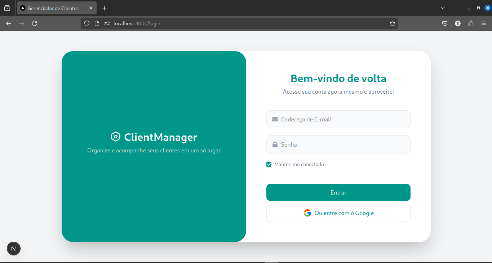
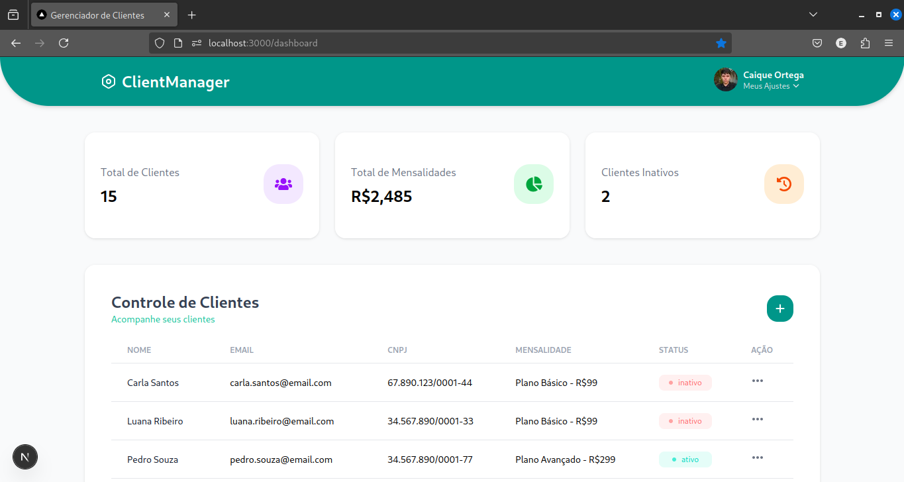
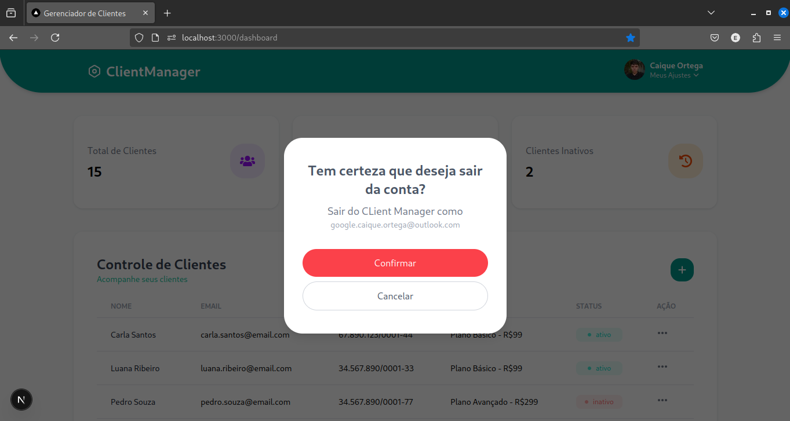
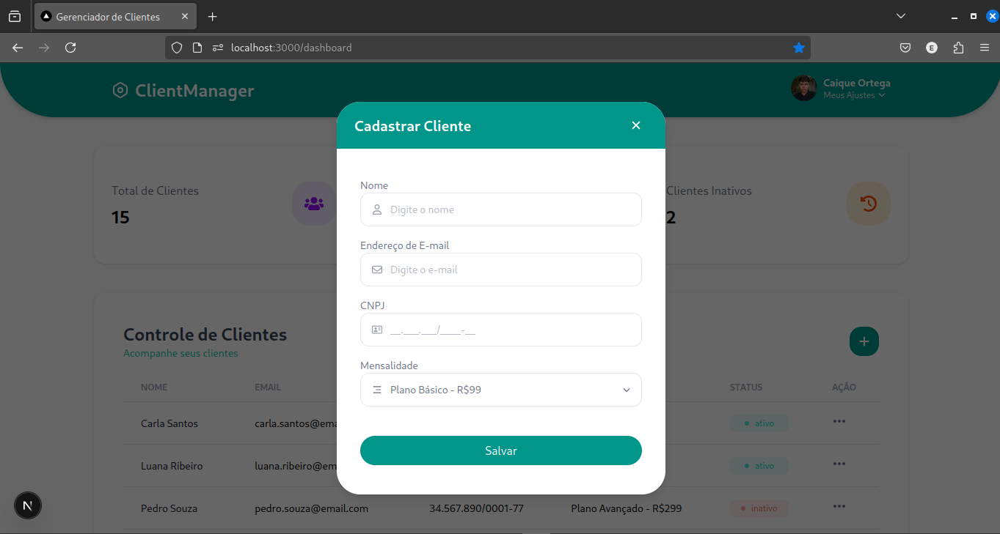
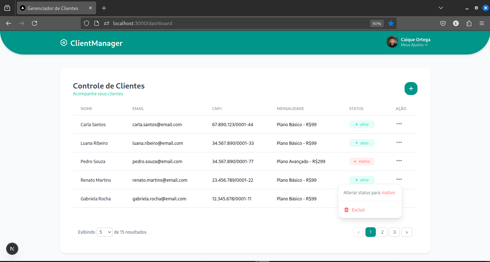
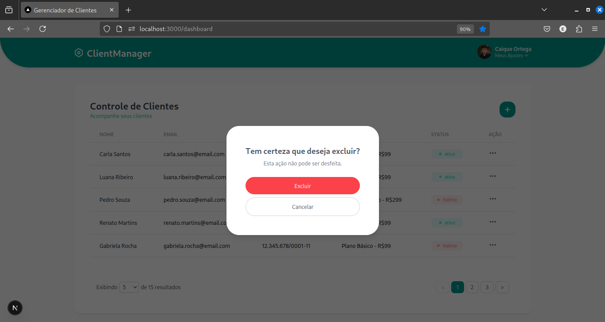

# 🚀 Client Manager 
**Client Manager** é uma aplicação de gerenciamento de clientes. O objetivo é criar um sistema simples e funcional para autenticação via Google e gerenciamento de dados de clientes, como nome, CNPJ, mensalidade e status.

---

## 🛠️ Stack Tecnológica

#### Construído com Next.js:
- **TypeScript**: Utilizado para garantir tipagem estática e melhorar a manutenção do código.
- **Tailwind CSS**: Facilita a estilização responsiva e rápida, sem a necessidade de escrever CSS manualmente.
- **ESLint/Prettier**: Ferramentas de linting e formatação para garantir código limpo e padronizado.

---

```bash
# Abra o terminal e execute os seguintes comandos:

# Clone o repositório
git clone https://github.com/CaiqueOrtega/client-manager-app

# Entre na pasta do projeto
cd client-manager-app

# Instale as dependências
npm install

# Rodando o Firebase Emulator
npm run dev:full
```
> ⚠️ ATENÇÃO: Se for rodar sem emulador lembre de comentar em src/lib/firebase/config/browser/index.ts:

```js
connectAuthEmulator(auth, 'http://localhost:9099');
connectFirestoreEmulator(db, 'localhost', 8080);
console.log('✅ Firebase configurado com emuladores locais');
``` 
---

## 📑 Funcionalidades

- **Tela de Login**: Permite login via Google utilizando Firebase Authentication.
- **Lista de Clientes**: Exibe e gerencia clientes, com funcionalidades para:
  - Alternar status entre "ativo" e "inativo".
  - Excluir clientes.
- **Formulário de Cadastro**: Permite adicionar novos clientes à lista com as seguintes informações:
  - Nome
  - CNPJ
  - Valor da mensalidade
  - Status (ativo/inativo)

---

# 📸 Imagens e Vídeos do Sistema









## 👨‍💻 Desenvolvedor

<table>
  <tr>
    <td align="center">
      
    </td>
    <td>
      <strong>Caique Ortega</strong><br />
      <i>Desenvolvedor Full Stack</i><br />
    </td>
    <td>
      <a href="https://github.com/caiqueortega">
        
      </a><br>
      <a href="https://www.linkedin.com/in/caiqueortega">
        
      </a>
    </td>
  </tr>
</table>
